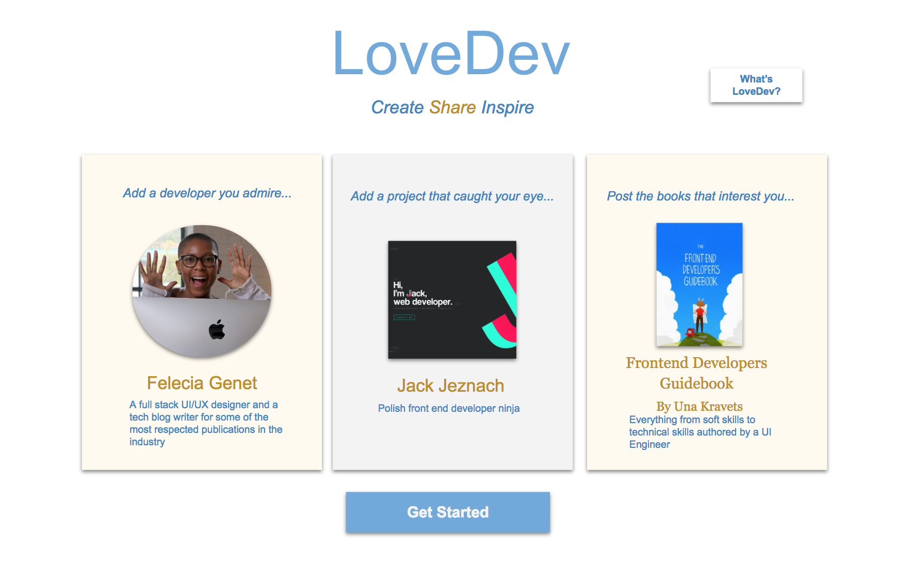
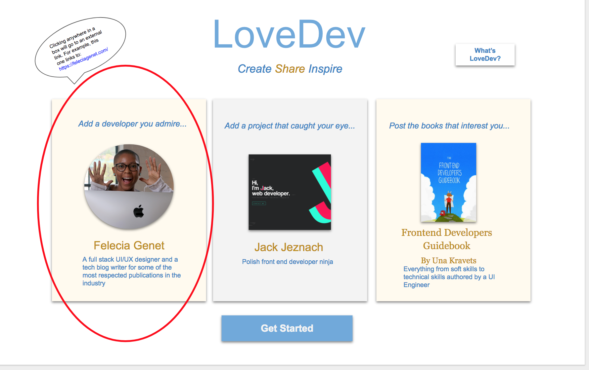
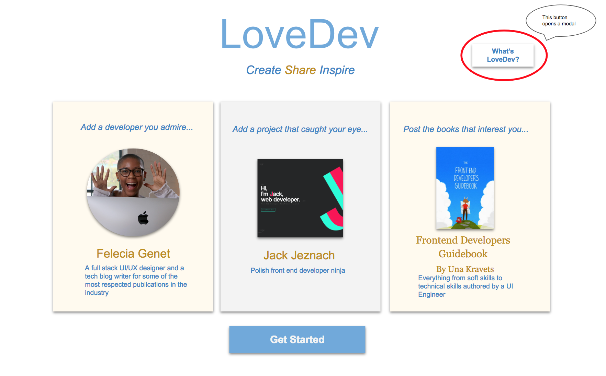
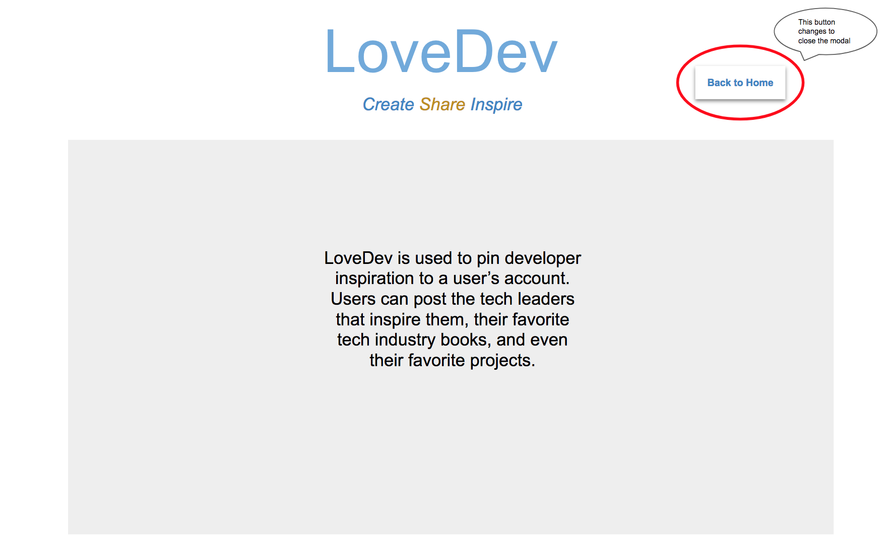
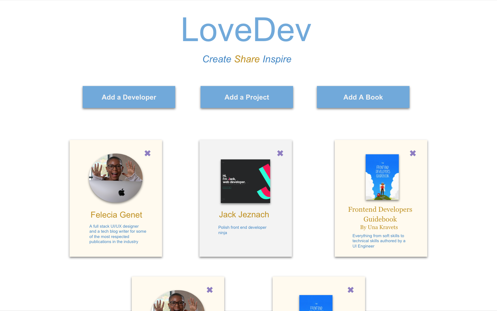
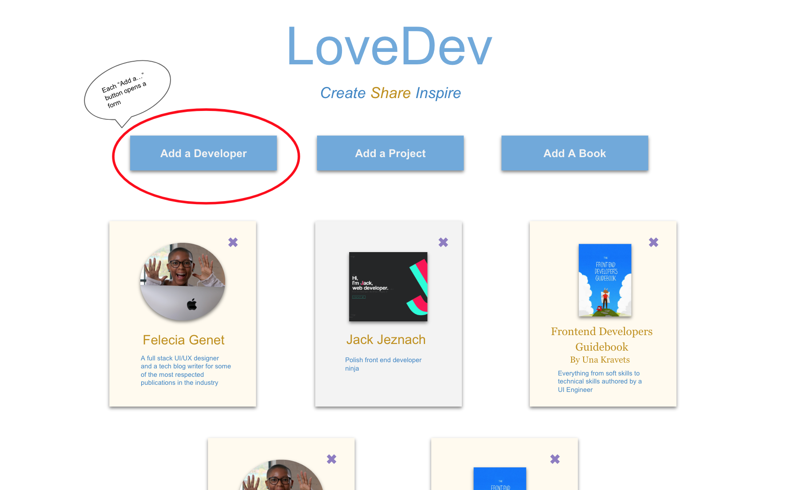
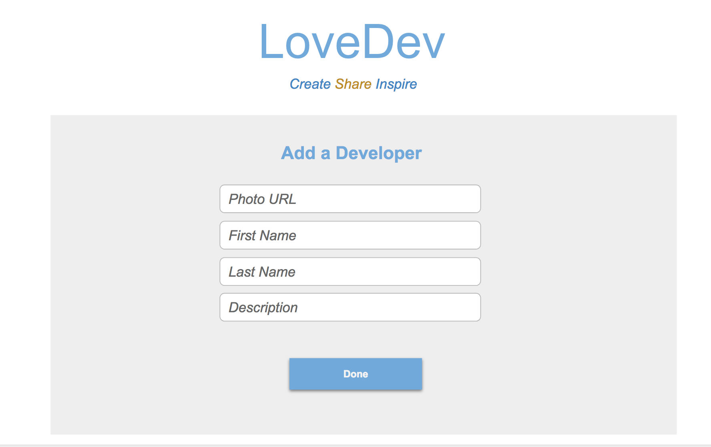
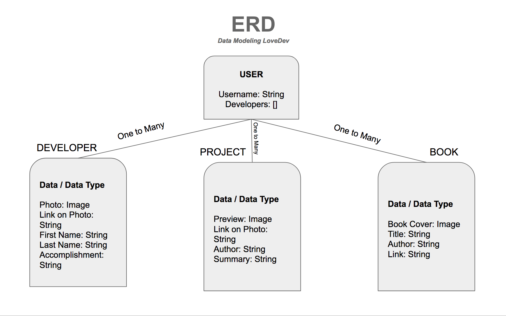

# LoveDev
MERN stack CRUD app that allows user to post web development inspiration

**Link to Deployed App on Heroku:** <https://warm-anchorage-85727.herokuapp.com/>  

**Link to User Stories on Trello:** <https://trello.com/b/Je319ix4/lovedev>

## Project Description

The goal of this project was to create a full stack application using the MERN stack. LoveDev is an original idea and it is meant to be a hub for technology inspiration. Users will be able to post the developers that inspire them to their personal accounts. Users are able to create, update, and delete their posts.

## Technologies Used

  * Frameworks - Express.js, MongoDB, React.js, Node.js
  * Languages - HTML5, CSS3, JavaScript, JSX
  * Wireframe - Google Slides
  * Project Planning & User Stories - [Trello](https://trello.com/b/Je319ix4/lovedev)
  * Deployment - Heroku - [Heroku](https://warm-anchorage-85727.herokuapp.com/)
  * Visual Studio Code
  * iTerm

## Features
 
  * Sign In/Sign Up
  * CRUD
  * ERD Data Model
  * Flexbox

## Wireframe

## Additions to a Future Version

  * TBD
